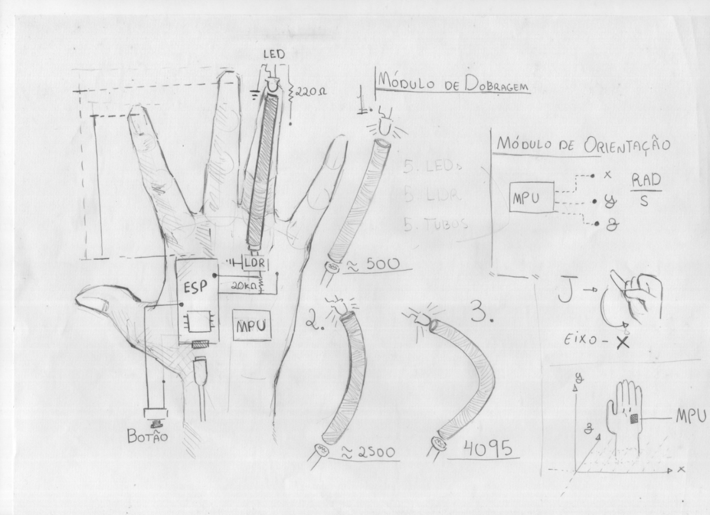
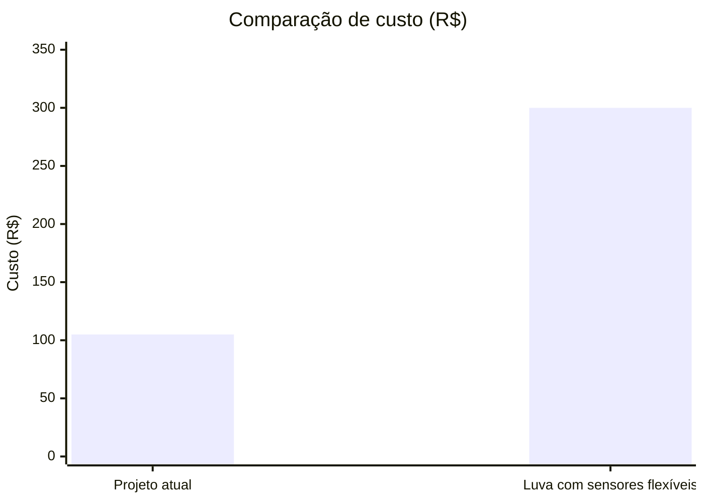

# Luva Tradutora de Libras


Sistema embarcado desenvolvido para reconhecer configurações de mão da Língua Brasileira de Sinais (Libras) e convertê-las em caracteres do alfabeto comum.

O projeto utiliza sensores ópticos para detectar a flexão dos dedos e uma unidade de medição inercial para determinar a orientação da mão, permitindo o reconhecimento de letras do alfabeto manual da Libras.

---

## Demonstração

Vídeo demonstrando o reconhecimento de alguns sinais e a conversão em texto/voz.


## Funcionamento

A luva utiliza sensores ópticos de flexão baseados na variação da intensidade luminosa entre um LED e um LDR posicionados em cada dedo.

Quando ocorre a flexão dos dedos, a quantidade de luz recebida pelo LDR é alterada, modificando sua resistência elétrica. Essas variações são utilizadas para determinar a posição dos dedos.

A orientação da mão é obtida através do sensor inercial MPU6050, que combina acelerômetro e giroscópio para estimar a posição e movimentação da mão.

### Aplicações

- Aprendizado conjunto da língua de sinais e língua escrita.
- Facilita a comunicação entre sinalizantes e não sinalizantes de libras

## Arquitetura

O sistema é dividido nos seguintes módulos:

- **Sensores de flexão:** responsáveis pela aquisição da posição dos dedos.
- **MPU6050:** responsável pela medição da orientação da mão.
- **ESP32:** realiza a leitura dos sensores e o processamento dos dados.
- **Algoritmo de classificação:** determina a letra correspondente ao sinal realizado.

## Hardware

| Componente | Função |
|------------|--------|
| Sensores ópticos (LED + LDR) | Detecção da flexão dos dedos |
| MPU6050 | Determinação da orientação da mão |
| ESP32 | Processamento dos dados dos sensores |

### Desenho Técnico



## Software

- Linguagem: C/C++
- Plataforma: Arduino IDE / PlatformIO
- Bibliotecas:
  - Adafruit MPU6050
  - Adafruit Unified Sensor
  - Wire.h (built-in Arduino library)

A biblioteca **Adafruit MPU6050** foi modificada para atender aos requisitos específicos deste projeto. A versão modificada está incluída neste repositório.

## Orçamento

Estimativas de custo dos componentes físicos e comparação com a abordagem tradicional (sensores flexíveis).

### Lista de Materiais e Custo

| Componente | Qtd | Preço Unitário(R$) | Total(R$) |
|------------|-----|----------------|-------|
| LED vermelho 5 mm	| 5	| 0,49 – 0,60 |	2,45 – 3,00 |
| Fotorresistor LDR 5 mm | 5	| 0,70 – 1,00	| 3,50 – 5,00 |
| Resistor 220 Ω 1/4 W | 5 |	0,05 – 0,06 |	0,25 – 0,30 |
|Resistor 20 kΩ 1/4 W |	5 |	0,06 – 0,07 |	0,30 – 0,35 |
|Tubo flexível (termorretrátil)	| 5 metros	| 1,99 – 2,09 |	9,95 – 10,45 |
| Giroscópio/acelerômetro MPU-6050 |	1 |	25,56 – 26,90 |	25,56 – 26,90 |
|ESP32 (DevKit)|	1|	56,90 – 59,90|	56,90 – 59,90|
|Botão push-button|	1|	3,20|	3,20|
|Total estimado		|||	102,11 – 109,10|

### Comparação utilizando sensores de flexão

A maioria dos projetos que tem como ideia uma luva de detecção de sinais costuma usar sensores de flexão, porém devido ao seu custo elevado o método do LED + fotorresistor traz grande vantagem econômica.



## Como executar

1. Clone este repositório.
2. Abra o projeto no PlatformIO.
3. Instale as dependências necessárias.
4. Conecte o ESP32 ao computador.
5. Faça o upload do firmware.

## Como usar

1. Após gravar o firmware, mantenha a ESP32 conectada via USB.
2. Execute `python audio/main.py`.
3. Faça os sinais em Libras; o caractere reconhecido aparecerá na tela e será falado via TTS.

## Estrutura do projeto

```text
.
├── .vscode/
├── audio/
│   ├── display.py
│   ├── leitor_serial.py
│   ├── main.py
│   └── tts.py
├── include/
├── lib/
│   ├── Adafruit_MPU6050/
│   └── README
├── src/
│   ├── convert_code.cpp
│   ├── convert_libras.cpp
│   ├── dados_sensores.cpp
│   ├── main.cpp
│   └── mpu6050.cpp
├── test/
│   └── README
├── .gitignore
├── platformio.ini
└── README.md
```

- `audio/` — scripts Python para leitura serial e síntese de voz (TTS).
- `src/` — código-fonte do firmware (ESP32).
- `lib/` — bibliotecas externas modificadas (Adafruit MPU6050).
- `include/` — headers do projeto.
- `test/` — testes do PlatformIO.

## Resultados

O sistema é capaz de reconhecer as seguintes letras do alfabeto manual da Libras:

| Letra | Reconhecimento |
|-------|----------------|
| A | ✓ |
| B | ✓ |
| C | ✓ |
| D | ✓ |
| E | ✓ |
| F | ✓ |
| G | ✓ |
| H | ✓ |
| I | ✓ |
| J | ✓ |
| K | ✓ |
| L | ✓ |
| M | ✓ |
| N | ✓ |
| O | ✓ |
| P | ✓ |
| Q | ✓ |
| R | ✓ |
| S | ✓ |
| T | ✓ |
| U | ✓ |
| V | ✓ |
| W | ✓ |
| X | ✓ |
| Y | ✓ |
| Z | ✓ |

## Autores

- Belchior Dias — [@Zurcaid](https://github.com/Zurcaid)
- João Victor Gouveia — [@JoaoVictorDevMeta](https://github.com/JoaoVictorDevMeta)
- Antonio Oliva — [@AntonioOliva27](https://github.com/AntonioOliva27)
- Pedro Luis — [@Pedrolk647](https://github.com/Pedrolk647)
- MiguelEulerQL — [@MiguelEulerQL](https://github.com/MiguelEulerQL)

## Referências

- Adafruit MPU6050 — https://github.com/adafruit/Adafruit_MPU6050
- Documentação ESP32 — https://docs.espressif.com/

## Licença

Este projeto está sob a licença MIT. Veja o arquivo [LICENSE](LICENSE) para mais detalhes.